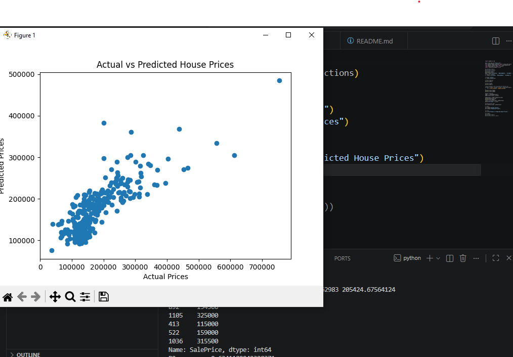

# PRODIGY_ML_01

# House Price Prediction using Linear Regression

This project is part of my Machine Learning Internship at Prodigy InfoTech.

The objective of this project is to build a Linear Regression model that predicts house prices using:

* Ground Living Area (`GrLivArea`)
* Number of Bedrooms (`BedroomAbvGr`)
* Number of Bathrooms (`FullBath`)

---

# Technologies Used

* Python
* Pandas
* Scikit-learn
* Matplotlib

---

# Machine Learning Workflow

* Data Loading & Preprocessing
* Feature Selection
* Train-Test Split
* Linear Regression Model Training
* Price Prediction
* Model Evaluation using R² Score
* Data Visualization

---

# Model Performance

**R² Score:** `0.63`

The model achieved a decent prediction performance using only three features.

---

# Visualization

## Actual vs Predicted House Prices

---

# Dataset

Dataset used:
House Prices - Advanced Regression Techniques

Kaggle Link:
https://www.kaggle.com/c/house-prices-advanced-regression-techniques/data

---

# Key Learnings

Through this project, I learned:

* Basics of Machine Learning
* Linear Regression
* Feature & Target Selection
* Train/Test Splitting
* Model Evaluation
* Data Visualization
* Git & GitHub Workflow

---

# Author

**Yashi Rohara**
